<p align="center">
  
</p>

<h1 align="center">Hi, I'm Lemon</h1>

<p align="center">
  <strong>Frontend Lead · AI Application Engineer · System Builder</strong>
</p>

<p align="center">
  I build reliable AI-enabled products and complex business systems from zero to one.<br />
  把复杂业务做成清晰、稳定、可持续演进的产品。
</p>

<p align="center">
  <a href="https://github.com/mxy2316868975javascript">
    
  </a>
  
  
</p>

---

## System Status

```text
ROLE       Frontend Lead / AI Application Engineer
MISSION    Turn complex workflows into dependable product experiences
MODE       Building, governing, and improving systems
BASE       Shanghai, China
```

I work at the intersection of product delivery and frontend engineering: defining the architecture, shaping the user flow, and carrying the system through real operational complexity.

## What I Build

| Area | What it means in practice |
| --- | --- |
| AI applications | Agent platforms, AI-assisted document workflows, and human-in-the-loop interfaces |
| Business systems | Role-aware operational products spanning appointments, queues, records, inventory, and billing workflows |
| Data products | Large-scale visualizations, monitoring dashboards, log analysis, and lineage exploration |
| Engineering foundations | Reusable component systems, RBAC, navigation architecture, E2E testing, and multi-environment delivery |

## Focus Queue

- **AI agents and practical workflows** - useful tools that fit real teams and real operations.
- **Complex frontend architecture** - scalable routing, permissions, state, and multi-tenant context.
- **Data visualization at scale** - performance-minded interfaces for dense, high-volume information.
- **Product reliability** - clear guardrails, automated regression coverage, and maintainable systems.

## Toolbox

### Frontend

<p>
  
  
  
  
  
</p>

### Backend

<p>
  
  
  
  
</p>

### Automation

<p>
  
</p>

### Browser Extensions

<p>
  
</p>

### Data & Quality

<p>
  
  
  
  
  
</p>

## Delivery Record

```text
[ AI WORKFLOW ]     Built visual workflow configuration and model observability tools.
[ HEALTHCARE OPS ]  Delivered a role-aware operational system with real-time edit locking.
[ DATA AT SCALE ]   Optimized interfaces for 100k+ data points and 30+ chart components.
[ ENGINEERING ]     Established reusable components, RBAC, E2E coverage, and release foundations.
```

## Contribution Flow

<picture>
  <source media="(prefers-color-scheme: dark)" srcset="https://raw.githubusercontent.com/mxy2316868975javascript/mxy2316868975javascript/output/github-contribution-grid-snake-dark.svg" />
  <source media="(prefers-color-scheme: light)" srcset="https://raw.githubusercontent.com/mxy2316868975javascript/mxy2316868975javascript/output/github-contribution-grid-snake.svg" />
  
</picture>

---

<p align="center">
  <i>Open source work is being organized. Explore the pinned repositories below as they come online.</i>
</p>
